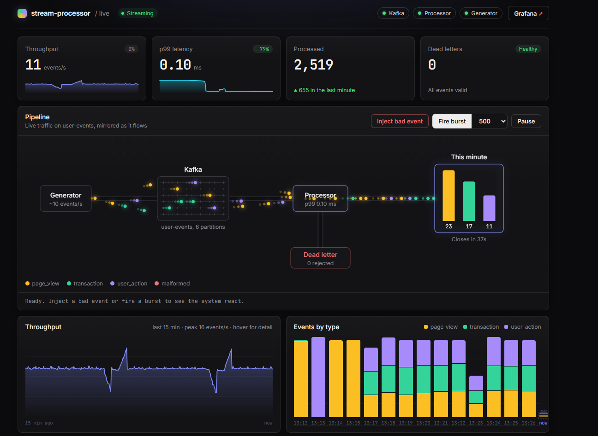

# Stream Processor

A production-style event stream processing pipeline in Go and Apache Kafka, with a live Angular dashboard for watching it work and breaking it on purpose. It covers windowed aggregation, dead-letter queues, retry with exponential backoff, graceful shutdown, and Prometheus observability.



## What it does

A generator simulates website users and publishes events (`page_view`, `transaction`, `user_action`) to Kafka. The processor consumes them, validates and enriches each one, and aggregates them into one-minute tumbling windows per event type. Results go to an output topic; malformed events go to a dead-letter topic with error metadata instead of crashing the pipeline.

The dashboard shows all of this live: events flowing through the pipeline, throughput and latency, closed windows, and dead letters. It also has fault-injection controls, so you can send a malformed event or a burst of thousands and watch the system react.

## Quick start

```bash
git clone https://github.com/Eroniction14/Stream_Processor.git
cd stream-processor/frontend
npm install && npm run build      # builds the dashboard UI
cd ../deployments
docker compose up -d --build
```

Then open:

| URL | What |
|---|---|
| http://localhost:8080 | Live dashboard |
| http://localhost:3000 | Grafana (admin / admin) |
| http://localhost:9091 | Prometheus |
| http://localhost:8081/healthz, `/readyz` | Processor health checks |
| http://localhost:9090/metrics | Raw processor metrics |

Startup is ordered with health checks: Kafka waits for a healthy Zookeeper, topics are created by a one-shot `kafka-init` job, and the processor, generator, and dashboard start only after it completes.

## Architecture

```
Generator ──► Kafka: user-events (6 partitions) ──► Processor ──► Kafka: aggregated-stats
                         │                              │
                         │                              └──► Kafka: dead-letter
                         │
                         └──────────────► Dashboard ◄──── Prometheus ◄── processor /metrics
                              (own consumer groups)
```

**Processor pipeline:** Deserialize → Route → Enrich → Aggregate → Emit. Each step implements a `Stage` interface, so steps are independently testable and replaceable.

**Dashboard:** a separate Go service that reads `user-events` and `aggregated-stats` through its own consumer groups, queries Prometheus, and streams updates to the browser over Server-Sent Events. It never touches the processor's code or consumer group, the same way a real downstream team would consume a topic. The UI is an Angular app embedded into the Go binary, so the dashboard ships as one container.

## Features

- Multi-stage pipeline built on a composable `Stage` interface
- Tumbling-window aggregation per event type (count, unique users, revenue, average duration)
- Dead-letter queue for poison messages (invalid JSON, missing ID) with error metadata headers
- Retry with exponential backoff and jitter
- Graceful shutdown: drains in-flight messages and flushes open windows
- Prometheus metrics with microsecond-resolution latency histograms
- Liveness and readiness endpoints
- Live dashboard with fault injection (malformed events, bursts up to 5,000)
- Integration tests against a real Kafka broker using Testcontainers

## Performance

Measured on a laptop (Docker Desktop, single processor instance):

| Metric | Measured |
|---|---|
| Processing latency, p50 | ~6 µs |
| Processing latency, p99 | ~90 µs |
| Processing latency, max | < 250 µs |
| Burst of 5,000 events | drained in X s |

Latency is in-process pipeline time per event (receive to aggregate), from the `processing_latency_seconds` histogram. It does not include time spent queued in Kafka. Steady-state traffic is about 10 events/s, set by the generator; bursts come from the dashboard's fault-injection controls.

## Bugs the dashboard caught

Building live observability surfaced real defects that tests hadn't:

1. **Generator ran at ~1 event/s instead of 10.** `kafka-go`'s `Writer` waits up to `BatchTimeout` (default 1 s) to fill a batch, and `WriteMessages` is synchronous, so every write blocked for about a second. Fixed by setting `BatchTimeout: 10ms`.
2. **All event types were merged into one window.** The aggregator keyed windows by time only, so each minute produced a single result labeled with whichever type arrived first, mixing transaction amounts into page views and diluting average durations. Fixed by keying on (window, event type); covered by a regression test.
3. **Open windows were lost on shutdown.** The "final flush" only emitted windows that had already ended, while their offsets were already committed. Shutdown now flushes every open window. A restart can therefore emit the same window twice (at-least-once), which the dashboard shows as a "revised" row.
4. **p99 latency was stuck at 0.99 ms.** The smallest histogram bucket was 1 ms, so every observation fell into it and the quantile estimate was pinned near the bucket edge. Buckets now start at 10 µs, which revealed the real p99 is about 90 µs.

## Project structure

```
stream-processor/
├── cmd/
│   ├── processor/        # Processor entrypoint
│   ├── generator/        # Event generator
│   └── dashboard/        # Dashboard server: Kafka readers, SSE, Prometheus proxy, fault injection
├── frontend/             # Angular dashboard UI (embedded into the dashboard binary)
├── internal/
│   ├── pipeline/         # Stages, aggregator, events
│   ├── consumer/         # Kafka consumer with retry and DLQ
│   ├── producer/         # Kafka producer (batched sink)
│   ├── state/            # In-memory state store
│   ├── metrics/          # Prometheus instrumentation
│   └── health/           # Liveness and readiness endpoints
├── config/               # YAML configuration
├── deployments/          # Docker Compose, Dockerfiles, Prometheus config
└── tests/integration/    # Testcontainers integration tests
```

## Testing

```bash
go test -short ./...                          # unit tests, no Docker needed
go test -v ./tests/integration/ -timeout 120s  # integration tests (needs Docker)
go test -race ./...                           # with the race detector
```

| Suite | Tests | Covers |
|---|---|---|
| Unit (pipeline) | 12 | Window aggregation per event type, shutdown flush, routing, validation, error propagation |
| Integration (end to end) | 1 | Produce → Kafka → pipeline → aggregated result on the output topic |
| Integration (DLQ) | 1 | Bad JSON and missing IDs routed to the dead-letter topic with error headers |
| Integration (health) | 1 | Liveness returns 200; readiness moves from 503 to 200 |

## Key design decisions

**segmentio/kafka-go over confluent-kafka-go.** Pure Go with no CGO, so builds and cross-compilation are simple. The trade-off is slightly lower raw throughput, and batching defaults that need tuning (see bug 1).

**Tumbling windows over sliding.** Simpler state with no overlap. Sliding windows could be added as another `Stage`.

**At-least-once delivery.** Offsets are committed as messages are consumed, and open windows are flushed on shutdown, so a restart can re-emit a window. Downstream consumers treat a repeated window as a revision. Exactly-once would need idempotent producers and Kafka transactions.

**Dashboard as an independent consumer.** It uses its own consumer groups and never touches processor internals, showing how Kafka decouples producers from any number of downstream readers.

**Zoneless Angular with signals.** The pipeline animation runs in a 60 fps canvas loop that only reads signals, so it never triggers Angular change detection. RxJS handles the event streams; signals hold UI state.

**In-memory state over RocksDB.** Keeps the project focused. A production system would use an embedded store with a changelog topic for crash recovery.

## Discussion points

- **Exactly-once:** idempotent producers plus the transactional API, and how that interacts with windowed state.
- **Backpressure:** what happens when processing falls behind consumption (buffered channels, rate limiting, pausing the consumer). Fire a 5,000-event burst on the dashboard to see it.
- **Horizontal scaling:** consumer-group partitioning; maximum parallelism equals the partition count (6 here).
- **Late events:** tumbling windows currently drop late arrivals; watermarks and allowed lateness would fix that.
- **State recovery:** in-memory windows are lost on a crash (as opposed to a graceful shutdown); changelog topics or RocksDB would fix that.

## Tech stack

Go 1.24 · Apache Kafka · Prometheus · Grafana · Angular 20 · Docker · Testcontainers

## Author

Eroniction Presley, MS Computer Science at Northeastern University

## License

MIT